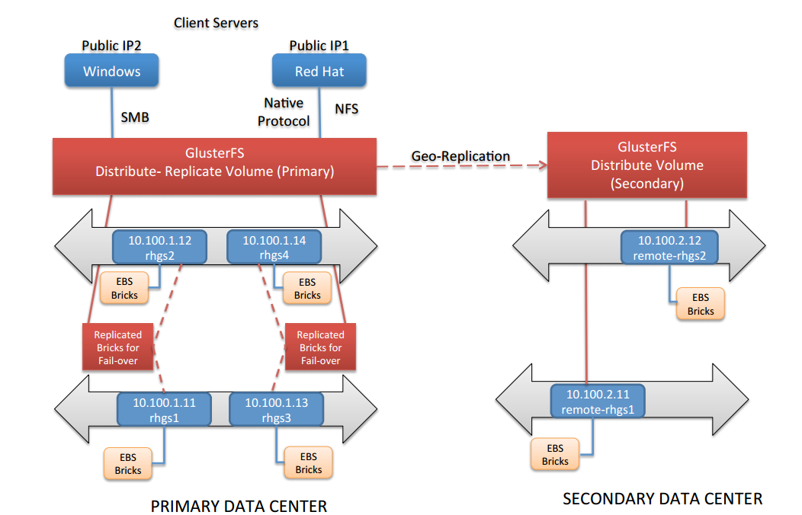

= Gluster Conceitos Lab

Neste conjunto de exercícios você irá explorar as funcionalidades e conceitos do Red Hat Gluster Storage com clusters locais e remotos, montar volumes usando diferentes protocolos, trabalhar com snapshots de volume e usar o console para configurar geo-replicação.

== Overview do Laboratório

Este laboratório é composto pelos seguintes servidores:

.Lab Environment Systems
[options="header"]
|===
|Label|FQDN|Internal IP Address|External Access

|RHS_v3.X_CLIENT1
|External: client1-0514.rhpds.opentlc.com
Internal: client1.localdomain
|10.100.0.101
|SSH

|RHS_v3.X_RHGS1
|rhgs1.localdomain
|10.100.1.11
|N/A
|RHS_v3.X_RHGS2

|rhgs2.localdomain
|10.100.1.12
|N/A
|RHS_v3.X_RHGS3
|rhgs3.localdomain

|10.100.1.13
|N/A
|RHS_v3.X_RHGS4
|rhgs4.localdomain

|10.100.1.14
|N/A
|RHS_v3.X_REMOTE_RHGS1
|remote-rhgs1.localdomain
|10.100.2.11
|N/A

|RHS_v3.X_REMOTE_RHGS2
|remote-rhgs2.localdomain
|10.100.2.12
|N/A

|===

Abaixo o desenho da arquitetura:

== Acessando o Ambiente de Laboratório

Execute este lab com seu usuario no servidor rhgs1.localdomain. Lembre de que você deve primeiro conectar no client1 antes de acessar os storage nodes.

1 Use um cliente SSH a sua escolha e logue na estação client1-GUID.rhpds.opentlc.com (external name):

----
# ssh <USUARIO>@client1-0514.rhpds.opentlc.com
----
[NOTE]
====
Utilize o <USUARIO> que será informado durante o workshop pelo instrutor.
====

2 Acesse o host rhgs<n> a partir do client1:

----
[root@client1 ~]# ssh root@rhgs<n>
----
* Usuario: root
* Senha: Redhat12

[NOTE]
====
Utilize o servidor rhgs<n> que será informado durante o workshop pelo instrutor.
====
