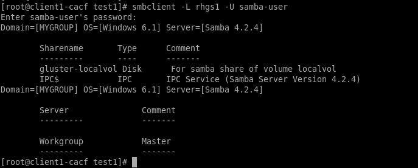

= Usando Serviços de Rede

Neste exercício você irá montar os mesmos volumes no client1 usando `NFSv3` e `SMB`

== Montando Red Hat Gluster Storage Volume Usando NFS

Nesta seção você irá montar o volume `localvol` usando o protocolo NFSv3. Primeiro você irá criar um diretório chamado /mnt/nfs<USER> e montar o volume usando protocolo NFSv3.

1 No client1, monte o localvol usando NFS:
----
# user_id=$(whoami)
# sudo mkdir /mnt/nfs$userid
# sudo mount -t nfs -o vers=3,mountproto=tcp rhgs1:/localvol /mnt/nfs$userid
----
[NOTE]
====
Você pode usar o comando showmount -e rhgs1 para confirmar qual path NFS usar.
====

2 Verifique os pontos de montagem:
----
# df -h
----

3 Va para o diretorio /mnt/nfs<USER>/test1 and list the contents:
----
# /mnt/nfs$userid/test1
# ls
----

Confirme que os 100 arquivos criados anteriormente se encontram no diretório.

== Montando Red Hat Gluster Storage Volume Usando SMB

Nesta seção você irá montar o mesmo volume `localvol` como um ponto de montagem usando o protocolo `SMB (CIFS)`.

1 No client1, instale os pacotes do cliente Samba:
----
[root@client1-GUID ~]# yum install -y samba cifs-utils samba-client
----

2 No client1, liste os volumes Samba disponíveis em rhgs1:
----
# smbclient -L rhgs1 -U samba-user
----

3 Confirme que o resultado que você teve foi similar a este:

.Listar volumes usando Samba

[NOTE]
====
A configuração de SMB adiciona "gluster-" ao inicio do nome do volume.
====

4 No client1, crie o ponto de montagem usando CIFs:

----
# user_id=$(whoami)
# mkdir /mnt/cifs$user_id
# mount -t cifs -ouser=samba-user //rhgs1/gluster-localvol /mnt/cifs$user_id
Password for samba-user@//rhgs1/gluster-localvol:  ********
# df -h
# cd /mnt/cifs$user_id/test1
# ls
----

* User: samba-user
* Password: r3dh4t1!

Note que o `df -h` retorna o mesmo volume (localvol) disponível do client1 esta agora disponível em três pontos de montagem usando três protocolos diferentes:

* Native Client mount (glusterfs direct mount)
* NFSv3
* SMB (CIFS)
